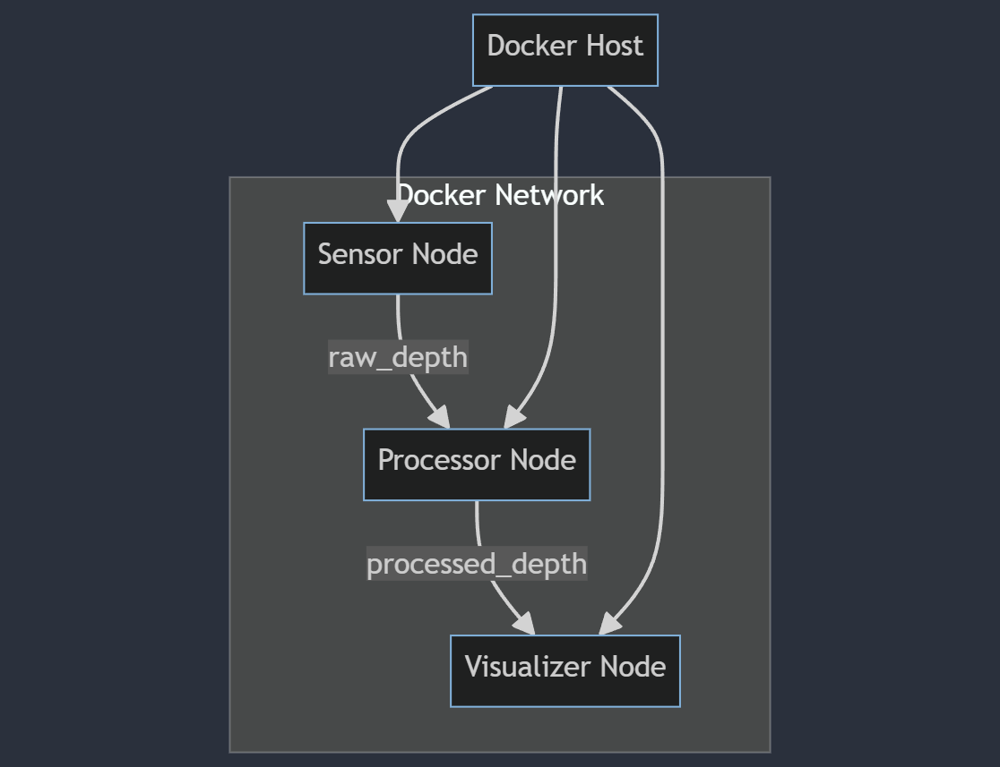

# ROS 2 Echo-Sounder System

This project implements a simulated echo-sounder system using ROS 2 (Robot Operating System 2) and Docker. The system consists of three nodes: a sensor node that generates simulated depth readings, a processor node that applies simple processing to the raw data, and a visualizer node that displays the processed depth data using ASCII art.

## Architecture

The system architecture is as follows:



- **Sensor Node**: Generates simulated depth readings and publishes them to the `raw_depth` topic.
- **Processor Node**: Subscribes to the `raw_depth` topic, processes the data, and publishes to the `processed_depth` topic.
- **Visualizer Node**: Subscribes to the `processed_depth` topic and displays the data using ASCII art visualization.

All nodes run in separate Docker containers and communicate over a shared Docker network.

## Prerequisites

- Docker
- Docker Compose (optional, for running with docker-compose)

## Building the Project

1. Clone this repository:
   ```
   git clone https://github.com/yourusername/ros2-echo-sounder.git
   cd ros2-echo-sounder
   ```

2. Build the Docker image:
   ```
   docker build -t echo_sounder_system .
   ```

## Running the System

### Using Docker Run

1. Create a Docker network:
   ```
   docker network create ros_network
   ```

2. Run the sensor node:
   ```
   docker run -d --name sensor_node --network ros_network echo_sounder_system ros2 run echo_sounder_pkg sensor_node
   ```

3. Run the processor node:
   ```
   docker run -d --name processor_node --network ros_network echo_sounder_system ros2 run echo_sounder_pkg processor_node
   ```

4. Run the visualizer node:
   ```
   docker run -it --name visualizer_node --network ros_network echo_sounder_system ros2 run echo_sounder_pkg visualizer_node
   ```

### Using Docker Compose

1. Ensure you have a `docker-compose.yml` file in your project root.

2. Run the entire system:
   ```
   docker-compose up --build
   ```

## Stopping the System

### If using Docker Run

```
docker stop sensor_node processor_node visualizer_node
docker rm sensor_node processor_node visualizer_node
```

### If using Docker Compose

```
docker-compose down
```

## Development

There are two alternatives to develop the project:

### Using vscode and Devcontainers
1. Install [Visual Studio Code](https://code.visualstudio.com/).
1a. If not installed, install the [Remote - Containers](https://marketplace.visualstudio.com/items?itemName=ms-vscode-remote.remote-containers) extension.

2. Open the project in Visual Studio Code.

3. Click the "Reopen in Container" button when prompted. Or the blue button in the bottom right corner of the window.

### Using Docker Run

1. Edit the Python files in the `src/echo_sounder_pkg/echo_sounder_pkg/` directory.
2. Rebuild the Docker image:
   ```
   docker build -t echo_sounder_system .
   ```
3. Restart the containers to apply the changes.

## Troubleshooting

If you encounter any issues:

1. Ensure all containers are on the same Docker network.
2. Check container logs:
   ```
   docker logs sensor_node
   docker logs processor_node
   docker logs visualizer_node
   ```
3. Verify the ROS 2 environment is properly sourced in the containers:
   ```
   docker run --rm echo_sounder_system ros2 --version
   ```

## Contributing

Contributions to this project are welcome! Please fork the repository and submit a pull request with your changes.

## License

This project is licensed under the MIT License - see the LICENSE file for details.
